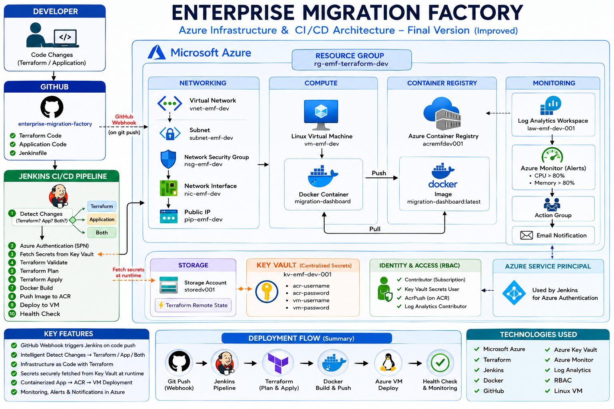

# Enterprise Migration Factory

## Overview
Fully automated DevOps pipeline provisioning 
Azure infrastructure via Terraform and deploying 
a containerized application through Jenkins CI/CD.

## Architecture

## Tech Stack
- Jenkins (CI/CD)
- Terraform (IaC — 9 modules)
- Docker + Azure Container Registry
- Azure Key Vault + RBAC
- Azure Monitor + Log Analytics
- GitHub Webhooks

## Pipeline Stages
1. Detect Changes
2. Azure Authentication (Service Principal)
3. Fetch Secrets from Key Vault
4. Terraform Validate → Plan → Apply
5. Docker Build
6. Push to ACR
7. Deploy to Azure VM
8. Health Check

## How to run
terraform init
terraform apply -var-file="dev.tfvars"